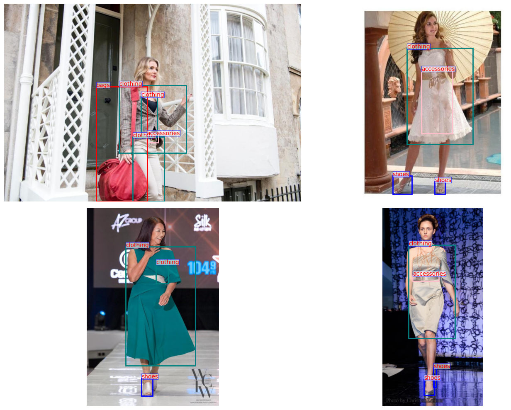

# Visual Search - 2023 - Object Detection Part

Repository containing all the exploration work done in August 2023. The work carried out up to this day only concerns the 'Object Detection' part. No work has been done yet regarding the 'Similarity Search' part.

This repository contains all the necessary information to train YOLO models (v5 or v8) or RT-DETR from scratch, for fine-tuning or transfer learning on a custom image dataset with the goal of object detection.
 

# Setup the environment
Once the repo has been cloned:
1.  `python -m pip install poetry`
2.	`poetry install`
3.	`poetry update`

# Dataset

The exploration work was carried out by experimenting on the dataset [FashionPedia](https://huggingface.co/datasets/detection-datasets/fashionpedia_4_categories/viewer/detection-datasets--fashionpedia_4_categories/train?row=0), An open-source dataset that provides approximately 47,000 'Fashion' product images in context. The version of the dataset considered here contains 4 types of annotated products: `Bags`, `Accessories`, `Clothing`, `Shoes`.


# Models

This repository is based on the `utralytics` API, which provides access to several architectures of pre-trained models for object detection tasks.

## Yolos
Of particular interest: [Yolov8](https://docs.ultralytics.com/models/yolov8/),available with multiple sizes, all pretrained on the COCO open-source dataset.


## RTDETR
I also conducted trials to incorpore Transformer-based models to my experiments. [RTDETR](https://docs.ultralytics.com/models/rtdetr/#overview) Also available on `ultralytics`API.


# Processing the data

It is absolutely MANDATORY for data to be in the YOLO format. [Click for further reading](https://docs.ultralytics.com/datasets/detect/)

This format is made of :
- a particular folders organization within the data folder (a folder `images/` and `labels/` along with an `instances.json` for each dataset).
- a `config.yaml` file indicating the set of labels as well as the different PATHS to the training, validation, and test datasets.. [EXAMPLE](project_visual_search/data/configs/fashionpedia.yaml)

## Download FashionPedia from HuggingFace

### Images and annotations

```
cd project_visual_search/data/fashionpedia
python fashionpedia_to_coco.py --data_path <DATA_FOLDER> --set train
python fashionpedia_to_coco.py --data_path <DATA_FOLDER> --set test
python fashionpedia_to_coco.py --data_path <DATA_FOLDER> --set val
```
Has to be precised every time: 
- `data_path` : the path where the data will be stored, example : `/project-visual-search/datasets/fashionpedia`
- `set` : train, test or val

### Generate labels as .txt files for each image

```
cd project_visual_search/data/fashionpedia
python create_labels.py --data_path <DATA_FOLDER_TRAIN>
python create_labels.py --data_path <DATA_FOLDER_TEST> 
python create_labels.py --data_path <DATA_FOLDER_VAL> 
```

Faire attention de bien générer les labels 3 fois (pour le folder de train, de test et de validation). Il est nécessaire que le `<DATA_FOLDER_PATH>` indiqué contienne un dossier `images/`.


# Training on custom dataset

## Fine-tuning

To initiate fine-tuning of a chosen model (for example, yolov8 small):
```
python project_visual_search/yolo_v8/finetuning.py --model yolov8s.pt --data_path /data/configs/fashionpedia.yaml --batch_size 32  --epochs 100 --save_period 5 --lr 0.001 

```
- Choose the `model` from `yolov8n.pt`, `yolov8s.pt`, `yolov8m.pt`, `yolov8l.pt`, `yolov8x.pt`. The weights will be automatically downloaded from the API.
- The `data_path` should point to the `.yaml` file describing the dataset in YOLO format (Required).

To initiate training of an RTDETR model:

```
python project_visual_search/detr/finetuning.py --model rtdetr-l.pt --batch_size 32  --epochs 100 --save_period 5 --lr 0.001 

```
Choose the `model` from `rtdetr-l.pt` and `rtdetr-x.pt`.

### Results 
After training, a folder containing all results, weights, and logs will be created in the `runs/` directory.


## Transfer Learning (Freeze Some Layers)

The same process is to be followed, but specify the number of "blocks" to freeze in our network using the `freeze` parameter.

```
python project_visual_search/detr/transfer_learning.py --model rtdetr-l.pt --freeze 20

```
**Note** that the `freeze` parameter is not inclusive. For a model with 23 modules like all YOLO models (numbered on PyTorch from 0 to 22), setting `--freeze 22` will freeze all layers from 0 to 21. However, layer numbered 22 (the last one) will not be frozen.

For YOLOv8 models, the **Detect Head** corresponds to the last module of the model, which is numbered 22.

Here is an overview of the size of the detect head for each YOLO size in terms of parameters.

| Yolo    | Total number of Params | Params in the Detect heads |
| -------- | ------- | --------|
| Nano| 3.1M|   800k  |
| Small| 11.1M| 2.14M|
| Medium| 25.9M|  3.8M |
| Large| 43.6M|  5.6M |
| XL| 59.4| 8.7M  |

# Evaluate a Model

To validate a YOLO model that has just been trained (same for RTDETR):


```
cd project_visual_search/yolo_v8
python validation.py --run <PATH TO THE MODEL>
```

`PATH TO THE MODEL` is for example `runs/train2`. A folder containing a `weights` sub-folder with the weights obtained during training should be present within. There is no need to specify the path of the validation dataset, as it has already been recorded by the Ultralytics API during model training (thanks to `config.yaml`).


# Generate Predictions

```
cd project_visual_search/yolo_v8 (ou detr)
python predict.py --run <RUN NAME> --data_path <IMAGE_FOLDER_PATH> --conf 0.25 --output_dir <DIR_TO_STORE_RESULTS>
 
 ```
 - `run`: Like during evaluation, you need to specify the run folder corresponding to the model you want to use for generating predictions.
- `data_path`: The folder of images on which you want to generate bounding box predictions.
- `conf`: This is the confidence threshold above which the model generates a bounding box.
- `output_dir`: The folder (which will be created automatically) where you want to store the annotated predictions. Example: `/home/aka/visual-search/project-visual-search/runs/predict/predictions_1`

## Example of generated predictions:

 
 


 # Next steps

 - Set up MLFlow for better experiment tracking.
 - Add flexibility in the data augmentation used during training (essential step for better performance on test + random data).

 
